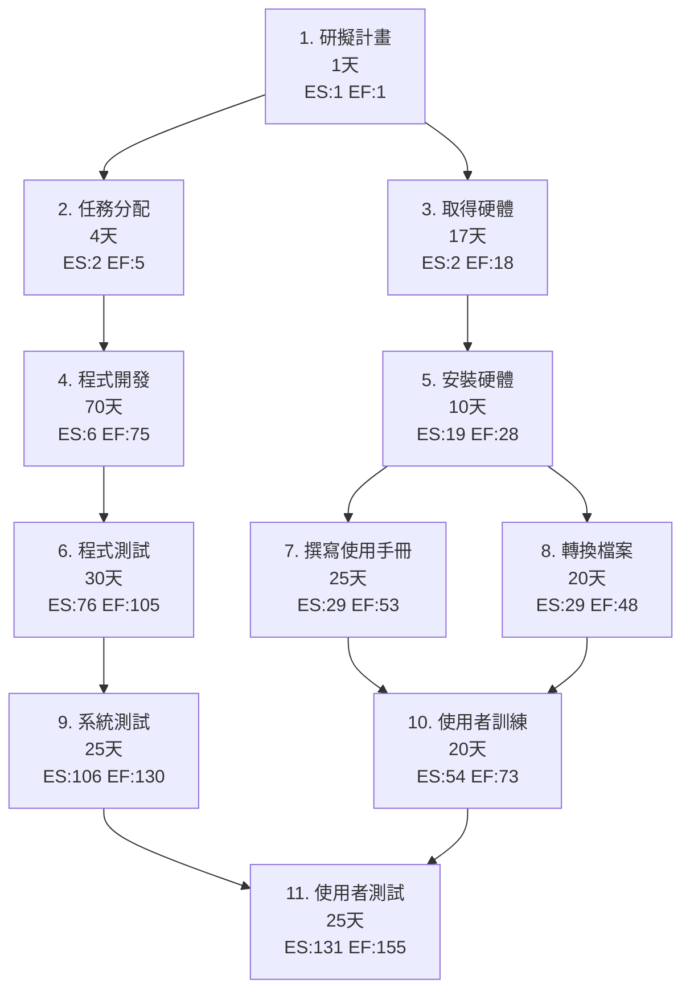
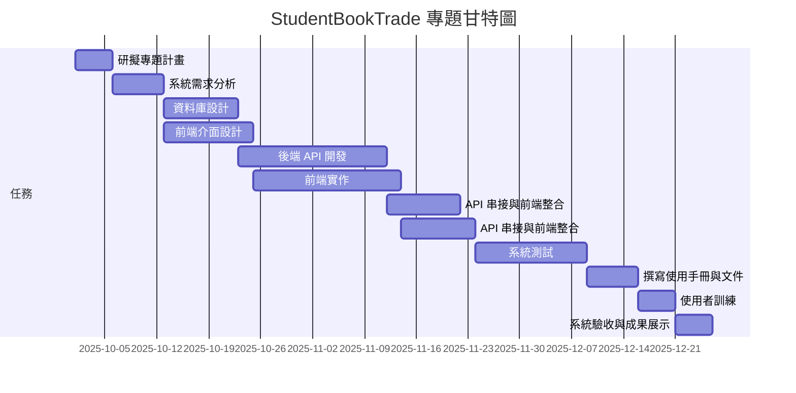

# 專案排程示意圖

##  流程圖 / 網絡圖
下面顯示專案各任務的順序與依賴關係：

## 甘特圖（時程規劃）

## 關鍵路徑分析

經過 PERT/CPM 分析，本專題的 **關鍵路徑 (Critical Path)** 為：

**1 → 2 → 3 → 5 → 7 → 8 → 9 → 10 → 11**

此路徑總計需時 86 天，是決定整個專案完成時間的關鍵路徑。在這條路徑上的任何延遲都會直接影響專案的完成時間，因此需要特別注意這些任務的進度管理。

---
